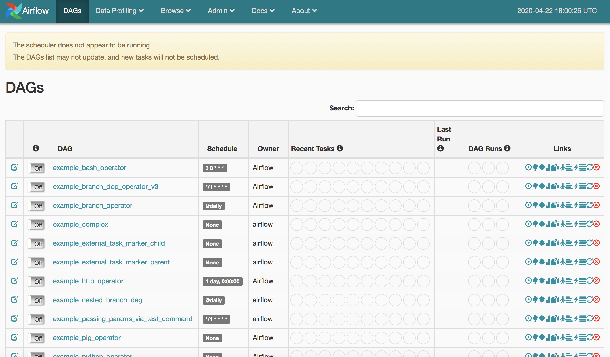

# airflow-mariadb
Run Airflow on MariaDB repository

This example reviews installing Apache Airflow and re-configuring it to use MariaDB.

The procedures for setting up the AWS instance and connecting to it are outlined [here](https://github.com/spineo/local-yum-mariadb/blob/master/README.md). For this example, we will install Airflow in the same Linux RHEL 8 AWS instance that is running the master MariaDB node.

First we will need to install/configure Python36 and Pip (the recommended way to install Apache Airflow)

As _root_ user (or using _sudo_) run the following commands:

```
yum install python36
yum install python36-devel
```

Python36 should automatically install _pip3_ which will be used to install Airflow


As self, we will install Apache Airflow as follows (we can subsequently set AIRFLOW_HOME in the ~/.bashrc):

```
export AIRFLOW_HOME=~/airflow
pip3 install --user apache-airflow
```

## Run the Web Server

Before starting, lets open up our target port _8080_ in AWS by navigating to the AWS Console, selecting our current instance checkbox, and then in the top menu navigating to _Actions -> Networking -> Change Security Groups_ and, as shown in the Screenshot below, selecting our target security group.


Next, navigate to ~/airflow and edit the _airflow.cfg_ file by modifying the below properties to use the public DNS (here we are duplicating and then commenting out the default properties)

```
[webserver]
# The base url of your website as airflow cannot guess what domain or
# cname you are using. This is used in automated emails that
# airflow sends to point links to the right web server
#base_url = http://localhost:8080
base_url = http://ec2-xxx-xxx-xxx-xxx.compute-1.amazonaws.com:8080

...

# The ip specified when starting the web server
#web_server_host = 0.0.0.0
web_server_host = ec2-xxx-xxx-xxx-xxx.compute-1.amazonaws.com
```

Start up the Web Server by running _airflow webserver -p 8080_ and navigating to the _base_url_ shown above. You should see the below UI render:



## Troubleshooting

As I started up the Web server I initially got the error _Error: No module named airflow.www.gunicorn_config_

Problem was easily resolved by running the below commands:

```
pip3 uninstall gunicorn
pip3 install --user gunicorn
```

Indeed, a good number of times these problems can be linked directly to a Python library installed incorrectly the first time around.

 By default, Airflow uses the SQLite database so we will run _airflow initdb_ to reconfigure the application to use MariaDB.

